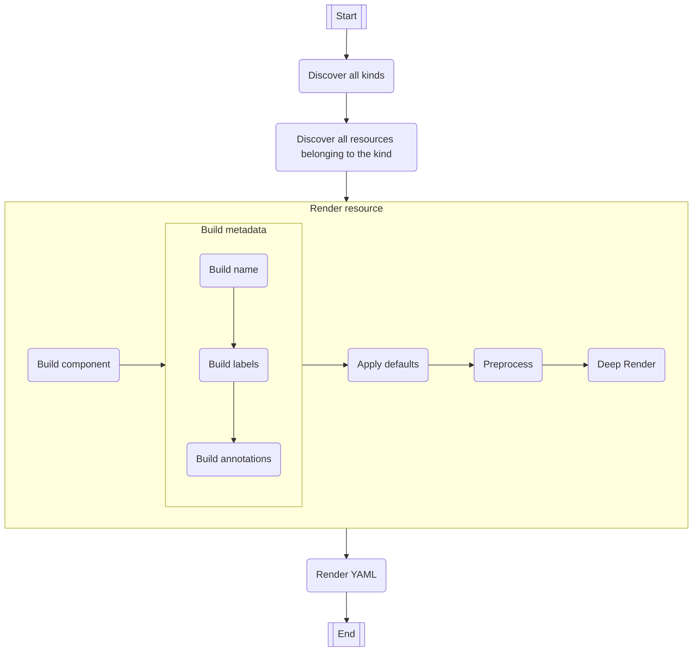

# Rendering

There is the complete resource rendering pipeline:



## Discover all kinds

Chart will render all resources kinds with

- `template: true` defined in the `config/resources.yaml`.
- `settings.kind.disabled: false` in the values file. `false` is a default
  value here.

See also: [Config](config.md#Resources)

## Discover all resources belonging to the kind

There are 2 resource types:

- Standalone - Defined in the values file root. Example:

  ```
  configmaps.resource-name
  ```

  Where:

  - ``configmaps`` - Standalone resource kind
  - ``resource-name`` - Standalone resource name

- Related - Resource related to a Standalone one. Example:

  ```
  deployments.standalond-resource-name.related.services.related-resource-name
  ```

  Where:

  - ``deployments`` - Standalone resource kind
  - ``standalond-resource-name`` - Standalone resource name
  - ``related`` - Keyword which under all related resource can be defined.
    Your JSON Schema of the resource have to support it to use that feature.
  - ``services`` - Related resource kind
  - ``related-resource-name`` - Related resource name

Only resource with `enabled: true` will be discovered. `true` is a default
value here.

## Build resource

### Build component

Component is a unique identifier of the resource within the release. Format:

``kind-name``

Where:

- ``kind`` - Resource kind
- ``name`` - Resource name as defined in the values file

Example: for the resource

```yaml
deployments:
  main: {}
```

Component value will be:

```
deployments-main
```

### Build metadata

#### Build name

If resource explicitly defined in the `metadata.name` key - this value will be
used. If not - will be generated using the template:

```gotemplate
{{ include "metachart.fullname" $ }}-{{ $name }}
```

Example: for the resource

```yaml
deployments:
  main: {}
```

And Helm Release `release` resource name will be:

```
release-main
```


#### Build labels

Each Helm Release resource has labels:

- `helm.sh/chart` - Chart name as defined in `Chart.yaml`
- `app.kubernetes.io/instance` - Helm Release name
- `app.kubernetes.io/managed-by`- `Helm`
- `app.kubernetes.io/component`:
  - For Standalone resource - its own Component value
  - For Related resource - value of the parent Standalone resource

Other labels are being computed by merge of:

- Global labels defined in the `settings.global.labels` values file key
- Kind default labels
- Resource own labels

#### Build annotations

Resource annotations are computed by merge of:

- Global annotations defined in the `settings.global.annotations` values file
  key
- Kind default annotations
- Resource own annotations
- `checksums` feature annotations

Where `checksums` - special annotations which are a sort of industry standard
to, for example, restart pods which belongs to a Deployment or another replica
controller resource on related resource change.

To use `checksums` feature JSON schema of the kind must support
`metadata.checksums` key.

Example:

```yaml
deployments:

  #: Re-create deployment pods on any configmap change
  one:
    metadata:
      checksums:
        configmaps: "*"

  #: Re-create deployment pods on the specific configmaps change
  two:
    metadata:
      checksums:
        configmaps:
          - "one"
          - "two"
```

### Apply defaults

Defaults apply implies deep merge of the resource with value defined in the
`settings.kind.defaults` key.

There is non-standard deep merge function is used here. It follows default
`merge` Helm function behaviour except if it meets 2 slices - it will concat
them except overwrite. It makes possible, for example, to define volumes
attached to any Release Pod.

### Preprocess

To define kind preprocessor create a file

```
templates/preprocess/_kind.tpl
```

containing a function called `metachart.preprocess.kind` consuming params:

- `definition` - resource definition build on previous stages
- `name` - name generated on the [Build name](#Build name) stage
- `component` - component generated on the [Build component](#Build component)
  stage

There are some useful template functions to be used in preprocessors:

- `metachart.resourceMeta` - Build Object Meta
- `metachart.selectorLabels` - Build resource selector labels
- `metachart.setDefaults` - Set default for the resource

See [_metachart.tpl](../pkg/chart/resources/init/templates/_metachart.tpl) for
their definition.

### Deep Render

Discover all strings in resource definition and render them as Go templates.

## Render YAML

Render built resource as YAML
